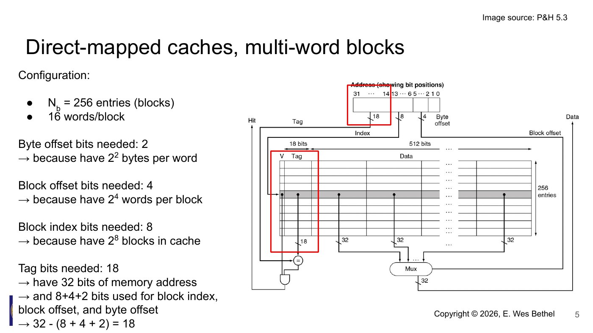
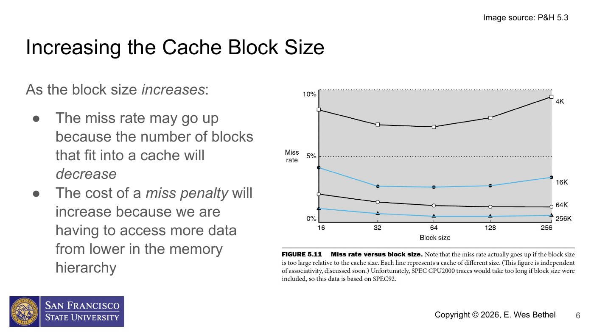
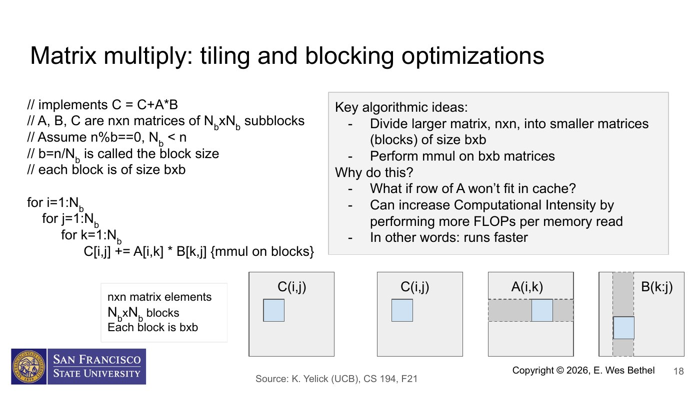
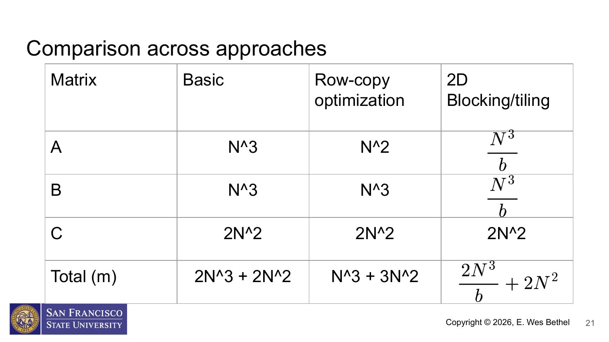
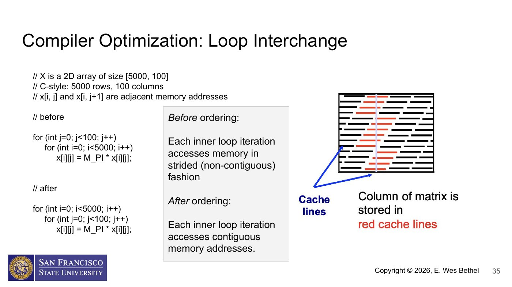

# CSC 746 Lecture 06: Optimizing Use of Cache

Date: 2026-09-10

Instructor: E. Wes Bethel

Source: `CSC 746 F26 Lecture 06 -- Optimizing Use of Cache.pdf` (41 slides)

## Purpose of these notes

This is an agent-oriented reference, not a slide-for-slide transcription. It preserves the definitions, performance models, algorithms, assumptions, and implementation guidance needed for the matrix-multiplication project. Repeated title slides and decorative material are omitted. Page references refer to the source PDF.

## Key takeaways

- Performance depends on how well the access pattern uses the memory hierarchy, not just on the number of arithmetic operations.
- Copying data into a compact working buffer can increase temporal and spatial locality.
- Tiling matrix multiplication can raise computational intensity from approximately 1-2 FLOPs per slow-memory access to approximately the tile width, provided three tiles fit in the target cache.
- C and C++ arrays are row-major. The innermost loop should normally vary the column index so accesses are contiguous.
- An optimization should be evaluated with an explicit memory-access model and measured performance; a smaller miss count is the mechanism, not the final goal.

## Memory hierarchy terminology

When the processor requests data:

- **Hit time** is the time to access a memory level, including the time needed to decide whether the request hit or missed.
- **Miss penalty** is the time to fetch a block from the next lower level. It includes latency, transfer time (bandwidth), and other overhead.
- **Average memory access time (AMAT)** is commonly modeled as:

  `AMAT = hit time + miss rate * miss penalty`

Larger cache blocks can exploit spatial locality, but they have two competing costs:

- Fewer blocks fit in a fixed-size cache, potentially increasing the miss rate.
- Each miss transfers more data, increasing the miss penalty.

### Direct-mapped address decomposition

For a 32-bit byte address, a direct-mapped cache with 256 entries, 16 words per block, and 4 bytes per word uses:

- 2 byte-offset bits (`log2(4)` bytes per word)
- 4 block-offset bits (`log2(16)` words per block)
- 8 index bits (`log2(256)` cache entries)
- 18 tag bits (`32 - 2 - 4 - 8`)





## Why matrix multiplication is the running example

Dense matrix multiplication (DGEMM for double precision) is useful because it:

- appears in many linear-algebra algorithms;
- performs `O(N^3)` arithmetic on `N x N` matrices;
- is central to LU factorization and the Top500 benchmark;
- is important in deep-learning workloads;
- has a simple algorithm whose performance changes dramatically with memory-access order.

The same locality ideas apply to many array-based computations.

## Computational intensity

The lecture uses:

- `f`: number of floating-point operations (FLOPs)
- `m`: number of slow-memory accesses
- `CI = f / m`: computational intensity under the simplified access model

Higher CI means more arithmetic is performed per slow-memory access. These models deliberately ignore the cost of cache hits and assume a clear boundary between fast and slow memory.

### Vector-matrix multiplication

For `y = y + A*x`, with vectors of length `n` and an `n x n` matrix:

```text
for i = 0 .. n-1
    for j = 0 .. n-1
        y[i] += A[i,j] * x[j]
```

Arithmetic:

- `f = 2n^2` (one multiply and one add per inner iteration)

Naive slow-memory references in the lecture's model:

- `2n` for reading and writing `y`
- `n^2` for reading `A`
- `n^2` for repeatedly reading `x`
- `m = 2n + 2n^2`
- `CI < 1`

With copy optimization, keep `x` and `y` in fast memory and stream each row of `A` through a compact buffer:

- `m = 3n + n^2`
- `CI` approaches 2 for large `n`

This improves locality, but vector-matrix multiplication remains strongly memory-bound.

## Copy optimization

Copy optimization means:

1. Copy a subset of the larger problem into a smaller, contiguous buffer.
2. Perform repeated operations on that buffer.
3. Copy results back if needed.

The intended effect is to keep the active working set in cache and reuse values before eviction. It relies on spatial locality (nearby addresses) and temporal locality (reusing recently accessed data).

The C/C++ language does not expose a command that says "put this in cache." A compact, repeatedly accessed buffer merely makes cache residency likely. The hardware still controls the cache.

### Basic matrix multiplication with row copy

For `C = C + A*B`:

```text
for i = 0 .. n-1
    copy row i of A into a compact buffer
    for j = 0 .. n-1
        load C[i,j] into a scalar/fast location
        copy column j of B into a compact buffer
        for k = 0 .. n-1
            C[i,j] += A[i,k] * B[k,j]
        store C[i,j]
```

The arithmetic count is `f = 2n^3`.

Under the lecture's slow-memory model:

- naive: `m = 2n^3 + 2n^2`, so `CI < 1`;
- row-copy version: `m = n^3 + 3n^2`, so `CI` approaches 2.

Copying only a row of `A` is not enough to eliminate the repeated column accesses to `B`.

## Blocking / tiling matrix multiplication

Partition each `n x n` matrix into `Nb x Nb` blocks, each `b x b`, where `Nb = n/b` and the simple presentation assumes `n % b == 0`.

```text
for bi = 0 .. Nb-1
    for bj = 0 .. Nb-1
        copy tile C[bi,bj] into the working set
        for bk = 0 .. Nb-1
            copy tile A[bi,bk] into the working set
            copy tile B[bk,bj] into the working set
            C_tile += A_tile * B_tile
        copy tile C[bi,bj] back to memory
```

The inner tile multiplication is itself a three-loop matrix multiply. Real code also needs cleanup logic when `n` is not divisible by `b`.



### Access model for tiling

Assuming the target cache can hold one tile each of `A`, `B`, and `C`:

| Approach | Reads of A | Reads of B | Accesses to C | Total slow-memory accesses |
|---|---:|---:|---:|---:|
| Basic | `n^3` | `n^3` | `2n^2` | `2n^3 + 2n^2` |
| Row-copy | `n^2` | `n^3` | `2n^2` | `n^3 + 3n^2` |
| 2D blocking | `n^3/b` | `n^3/b` | `2n^2` | `2n^3/b + 2n^2` |

For large `n` relative to `b`:

`CI = 2n^3 / (2n^3/b + 2n^2)`, which approaches `b`.

Thus, the model predicts that increasing the useful tile width increases arithmetic work per slow-memory access. In practice, `b` cannot grow without limit: three tiles plus other active data must fit in the chosen cache, and associativity/conflict effects matter.



### Assumptions behind the model

- Fast memory is large enough for three tiles.
- Fast-memory access cost is treated as zero.
- Memory latency is treated as constant.
- Copy overhead is represented only through the modeled slow-memory traffic.
- The model does not include cache associativity, hardware prefetching, TLBs, vectorization, instruction overhead, or multiple cache levels.

Use the equations to explain the mechanism and choose experiments, not as a substitute for measurement.

## Row-major array indexing in C/C++

A logically two-dimensional `M x N` C/C++ array is stored as one contiguous row-major sequence. For zero-based indices:

`offset(row, col) = row * N + col`

Example for a `2 x 3` matrix:

| Logical element | Flat offset |
|---|---:|
| `A[0,0]` | 0 |
| `A[0,1]` | 1 |
| `A[0,2]` | 2 |
| `A[1,0]` | 3 |
| `A[1,1]` | 4 |
| `A[1,2]` | 5 |

For row-major storage:

- changing the column by 1 usually moves to the adjacent element;
- changing the row by 1 jumps by `N` elements;
- nearby points in index space are not necessarily nearby in address space.

For column-major storage (historically used by Fortran), the locality directions are reversed.

## Loop interchange

Given `double x[5000][100]`, this order is strided in the inner loop:

```cpp
for (int j = 0; j < 100; ++j)
    for (int i = 0; i < 5000; ++i)
        x[i][j] *= M_PI;
```

Interchanging the loops makes the innermost access contiguous:

```cpp
for (int i = 0; i < 5000; ++i)
    for (int j = 0; j < 100; ++j)
        x[i][j] *= M_PI;
```



Loop interchange is legal only when it preserves dependencies and program semantics.

## Alternative memory layouts

Row-major and column-major layouts each privilege one traversal direction. A later case study asks whether a space-filling-curve layout can keep points that are near in multidimensional index space closer in physical memory. The referenced paper is:

- E. Wes Bethel, David Camp, David Donofrio, and Mark Howison, "Improving Performance of Structured-memory, Data-intensive Applications on Multi-core Platforms via a Space-filling Curve Memory Layout," HPDIC/IPDPS Workshop, 2015. <https://escholarship.org/uc/item/2668z21d>

## Practical checklist for CP2-style work

1. Establish a correct baseline implementation.
2. State the matrix layout and exact loop order.
3. Make the innermost traversal unit-stride where dependencies allow.
4. Implement blocking with a tunable `b`; handle edge tiles safely.
5. If using copy buffers, account for their allocation and copy cost.
6. Choose candidate block sizes from cache capacity, then sweep nearby values.
7. Measure runtime and a correctly defined FLOP rate; do not label FLOP rate as generic throughput.
8. Explain results using locality and measured evidence rather than assuming the model is exact.

## Source pointers

- Hennessy and Patterson, *Computer Architecture: A Quantitative Approach*, memory hierarchy and cache optimization sections.
- Kathy Yelick, UC Berkeley CS 194 materials (cited on the matrix-operation slides).
- Row- and column-major ordering overview: <https://en.wikipedia.org/wiki/Row-_and_column-major_order>
