# CSC 746 Lecture 07: Optimizing Use of Cache, Continued

Date: 2026-09-15

Instructor: E. Wes Bethel

Source: `CSC 746 F26 Lecture 07 -- Optimizing use of cache, ctd.pdf` (59 slides)

## Purpose of these notes

This agent-oriented reference condenses the lecture's review of classic cache-optimization research and its case studies. It keeps the algorithms, models, caveats, empirical conclusions, and source links. Several source slides are image-only, so the most informative graphs and diagrams are included below.

## Course-specific analysis and writing constraints

- MFLOP/s is a floating-point operation rate, not a synonym for generic "throughput."
- Fabricating measurements is scientific and academic misconduct.
- Do not repeat terminology produced by an AI tool unless you understand and can justify it.
- For the course project, use concepts covered in the course up to the relevant assignment date.
- Build a repeatable analysis/writing playbook: define the metric, state the hypothesis, describe the experiment, show the result, and connect evidence to the conclusion.

## Research covered

1. M. Lam, E. Rothberg, and M. Wolf, "The Cache Performance and Optimizations of Blocked Algorithms" (1991). <https://dl.acm.org/doi/10.1145/106974.106981>
2. G. Rivera and C.-W. Tseng, "Locality Optimizations for Multi-Level Caches" (1999). <https://dl.acm.org/doi/pdf/10.1145/331532.331534>
3. M. Frigo, C. Leiserson, H. Prokop, and S. Ramachandran, "Cache-Oblivious Algorithms" (1999). <https://dl.acm.org/doi/10.5555/795665.796479>
4. U. Drepper, "What Every Programmer Should Know About Memory" (2007). <https://people.freebsd.org/~lstewart/articles/cpumemory.pdf>

The studies span direct-mapped caches, multi-level caches, ideal-cache analysis, data layout, prefetching, vector-friendly layouts, TLBs, and NUMA.

## 1. Blocked algorithms: capacity and conflict misses

### Motivation

Floating-point execution rates have historically improved faster than memory access. Naive dense-linear-algebra loop nests can therefore run far below peak compute capability. Blocking and loop transformations try to retain a useful working set in cache and make accesses predictable.

Blocking can be applied at several hierarchy levels:

- register blocking;
- small software buffers;
- L1/L2/L3-sized tiles;
- larger partitions designed for page or NUMA locality.

### Cache-miss categories used in the lecture

- **Intrinsic misses**: compulsory/capacity-like misses inherent in bringing the blocked data into cache. In the paper's model, their rate generally decreases as block size `B` grows.
- **Self-interference misses**: different addresses from the same array map to the same direct-mapped cache location and evict one another.
- **Cross-interference misses**: addresses from different arrays map to the same cache location and evict one another.

Interference misses can occur even when the total live data is smaller than cache capacity. This is why "the tile fits in cache" is necessary but not always sufficient.

### Block-size behavior

In the modeled 1K-word direct-mapped cache:

- intrinsic misses fall as `B` grows, up to a capacity-related limit;
- beyond a critical `B0`, self-interference rises sharply;
- cross-interference is also relevant, but may taper after self-interference dominates;
- the most aggressive average block size may have high variance across matrix sizes.

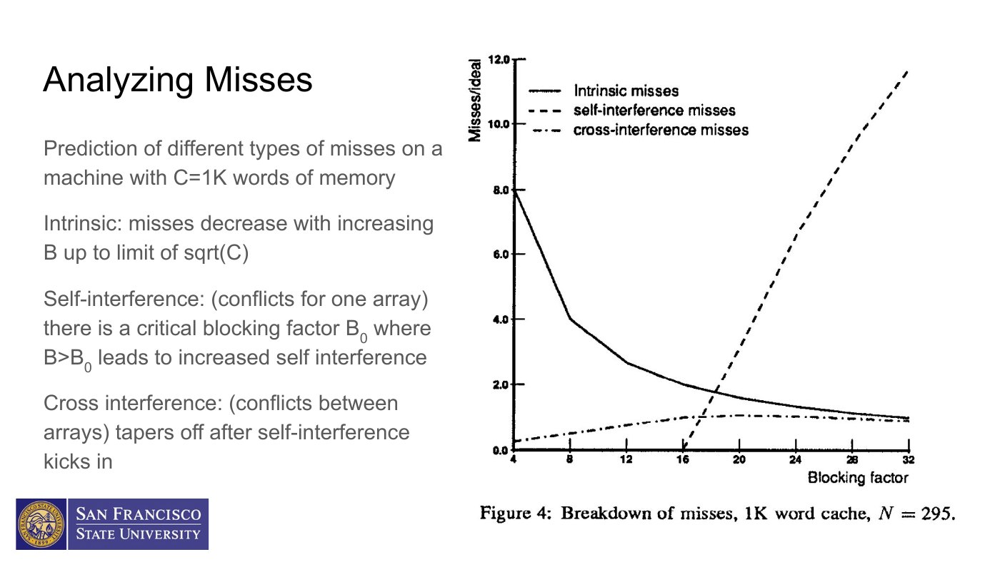

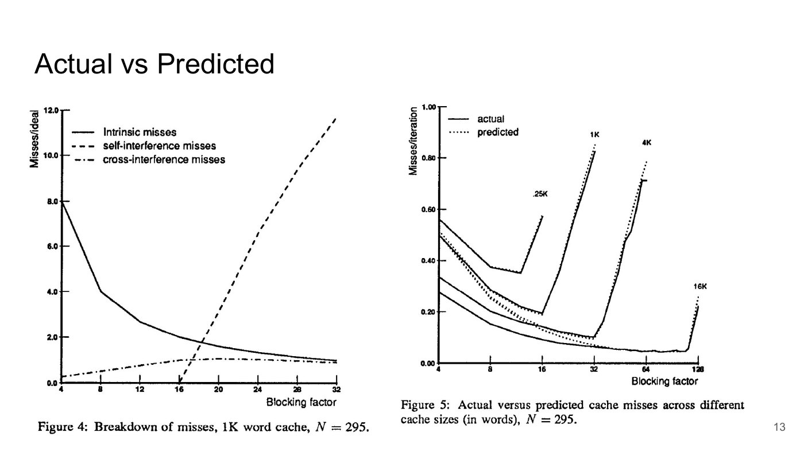

The lecture's example compares block sizes 8 and 12: `B=12` can have a slightly lower predicted average miss rate, while `B=8` has substantially less variation. Robustness across problem sizes can matter more than a narrowly optimal mean.

### Historical performance result

On a DECStation 3100 with a 16.67 MHz MIPS R2000 and an 8K direct-mapped cache, blocking delivered roughly a 3-4x speedup. Performance varied sharply for nearby matrix sizes (for example, 300, 295, and 293), illustrating that address mapping and conflict misses can dominate seemingly minor size changes.

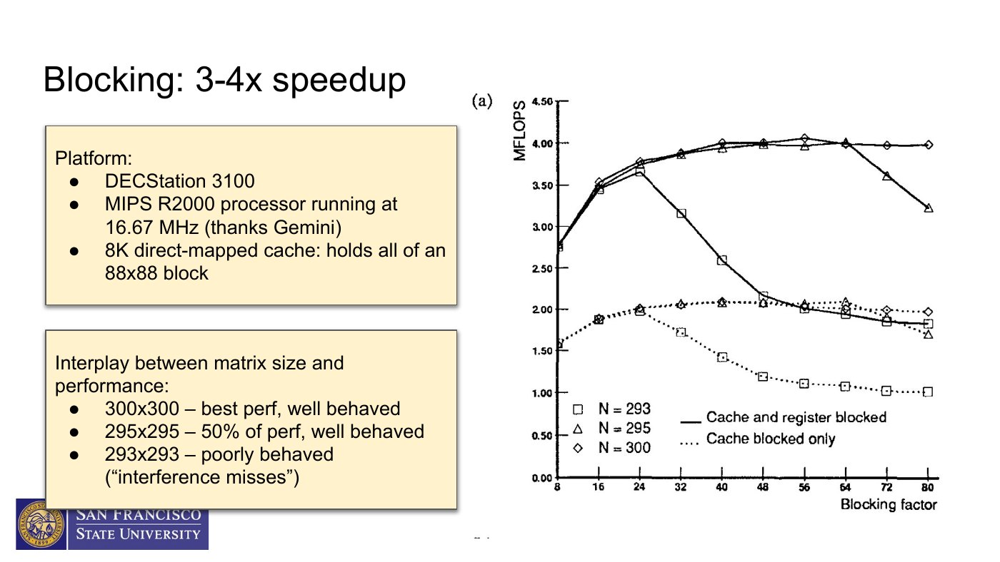

### Blocking versus block-and-copy

Register blocking directly accesses the original matrices. It is not, by itself, a copy optimization.

Block-and-copy adds a packed, contiguous buffer. Packing can:

- eliminate or reduce self-interference;
- turn a strided region into a unit-stride region;
- improve prefetching and vectorization opportunities;
- add copy, allocation, and edge-handling overhead.

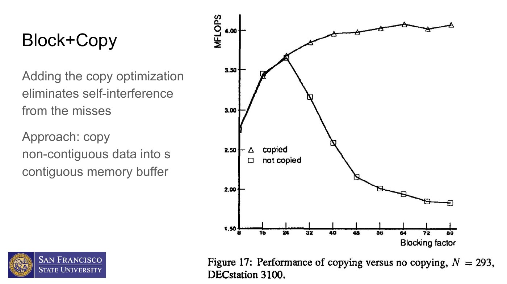

### Findings from Lam, Rothberg, and Wolf

- Blocking can dramatically reduce capacity misses and produce multi-fold speedups.
- A working-set model gives useful first estimates for block size.
- Unit-stride inner loops, loop interchange, and padding can materially improve results.
- Copying/packing can reduce self-interference beyond what blocking alone achieves.
- Block-size selection is architecture- and problem-size-sensitive; it should be measured.

## 2. Locality transformations for multi-level caches

Rivera and Tseng examine how compiler/program transformations interact across multiple cache levels. The transformations include loop permutation, array transpose, padding, alignment, loop fusion/distribution, and tiling.

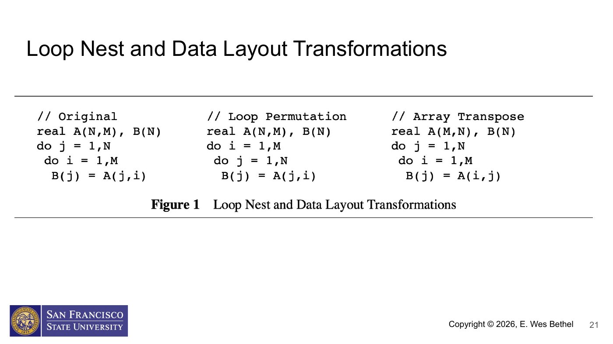

### Intervariable padding

If two arrays' base addresses differ by a multiple of a direct-mapped cache's size, corresponding unit-stride accesses may continually collide. Padding or aligning arrays at different offsets can separate their cache mappings.

A compiler-oriented approach is:

1. analyze array access patterns;
2. estimate which references are live together;
3. choose base-address offsets that minimize cross-interference.

Padding is not universally beneficial. The preferred offset depends on which arrays are reused together in a particular loop nest.

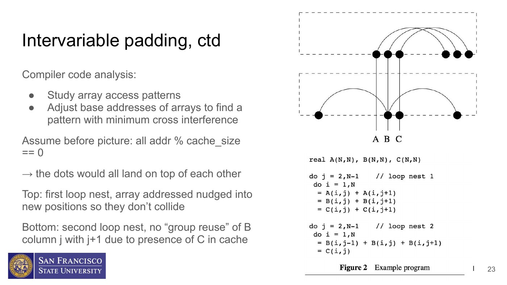

### Loop fusion

Loop fusion combines adjacent loops. It can:

- reuse a value before eviction;
- remove redundant loads/stores between producer and consumer loops;
- expose other transformations;
- increase the live working set and create new conflicts.

Fusion is a locality tradeoff, not an unconditional win.

### Tiling for multiple levels

Tiling combines strip-mining and loop permutation. Small tiles reduce the working set but increase loop/copy overhead. Large tiles amortize overhead but risk capacity and conflict misses. The reviewed study recommends first targeting an important cache level (often L1) and evaluating the result across the hierarchy rather than assuming one tile size optimizes every level.

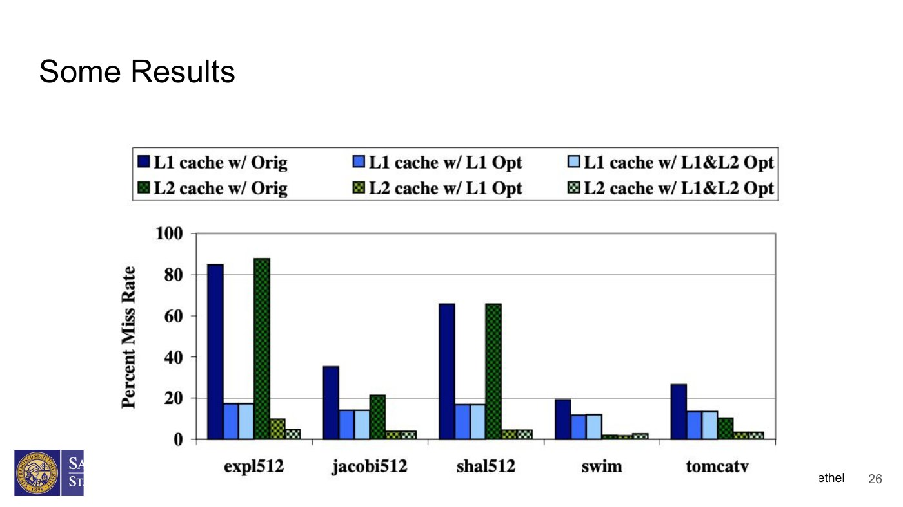

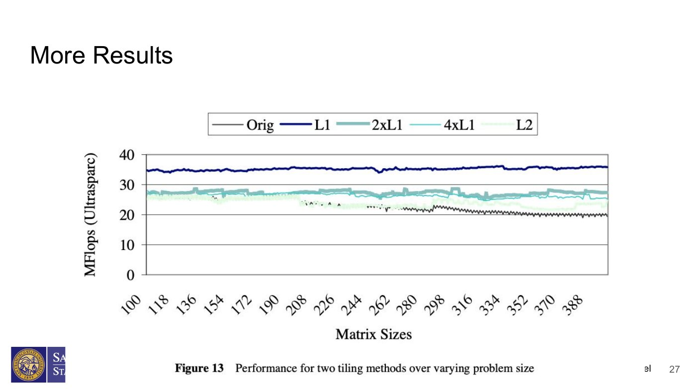

## 3. Cache-oblivious algorithms

### Definitions

- A **cache-aware algorithm** exposes parameters selected for a cache size `M` and cache-line/block size `B`. Tiled matrix multiplication with a tuned tile width is cache-aware.
- A **cache-oblivious algorithm** contains no explicit `M` or `B` parameter. Recursive subdivision is intended to produce subproblems that eventually fit at every cache level.

The ideal-cache model assumes:

- a cache containing `M` words;
- cache lines containing `B` words;
- optimal replacement;
- a "tall cache" assumption. The source slide writes `M = O(B^2)`; the conventional lower-bound form in cache-oblivious analysis is `M = Omega(B^2)` (the cache can hold at least on the order of `B^2` words).

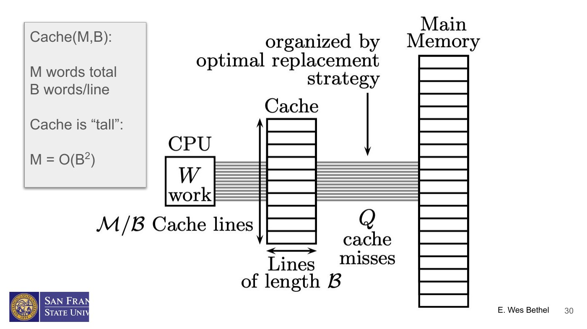

### Recursive rectangular matrix multiplication

For `A[M][N] * B[N][P] -> C[M][P]`:

1. Find the largest dimension among `M`, `N`, and `P`.
2. Bisect along that dimension.
3. Recurse on the two smaller rectangular multiplications.
4. At the base case, perform a direct multiplication.

Splitting `M` or `P` partitions the output; splitting `N` produces two partial products that accumulate into the same `C` region.

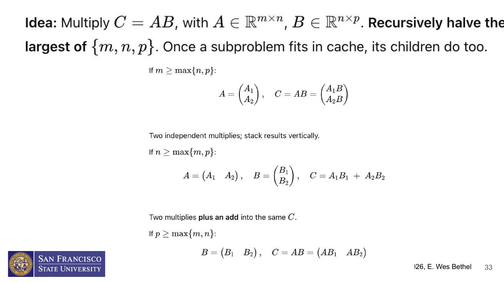

The theoretical base case is a single element (`m=n=p=1`). Practical implementations normally stop earlier to reduce recursion overhead. Once the base-case threshold is tuned to a machine, the implementation is no longer purely parameter-free, although its recursive layout can still provide multi-level locality.

### Key bounds and caveats

- Matrix multiplication: `Theta(N^3 / (B*sqrt(M)))` cache misses under the stated model, asymptotically matching tuned blocking.
- Matrix transpose: `Theta(N^2 / B)` misses with recursive partitioning.
- Similar ideas apply to scanning, FFTs, sorting, and recursive tree layouts.
- Constants, call overhead, SIMD, hardware prefetching, and base-case code still determine practical performance.

## 4. Space-filling-curve memory layout case study

The case study compares conventional row-major ("A-order" in some slides) storage with Z-order/Morton-order storage.

### Z-order idea

Row-major layout preserves locality along rows but can place geometrically nearby points far apart in memory. Z-order recursively subdivides space and interleaves coordinate bits, aiming to keep nearby multidimensional points near one another in address space across several scales.

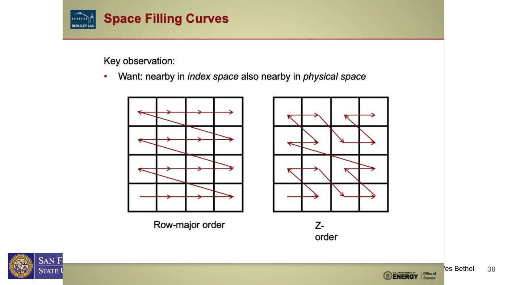

Z-order index computation uses bit shifts/masks/interleaving rather than a simple `row * width + column`. This adds address-computation cost, and conversion/packing cost must be included in an end-to-end evaluation.

### Raycasting volume rendering

For each image pixel, a ray passes through a 3D volume. Samples along the ray use neighboring voxels (for example, trilinear interpolation). The access direction depends on the viewpoint, so some views align well with row-major memory and others do not.

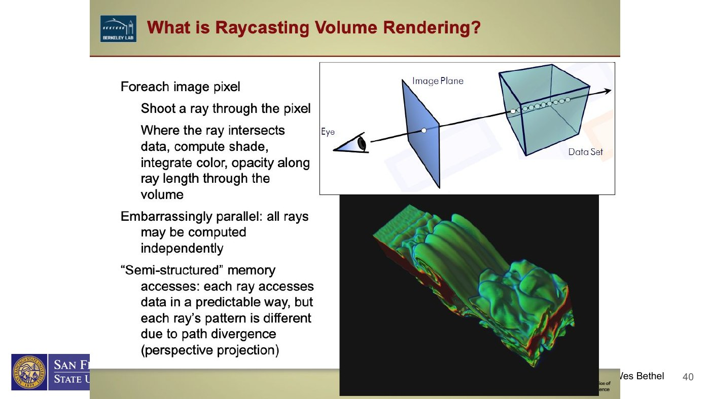

Observed pattern on the Ivy Bridge test system:

- row-major performs competitively when rays align with its favored memory direction;
- row-major runtime and memory traffic worsen for misaligned viewpoints;
- Z-order performance is more stable across viewpoints;
- the memory metrics support the explanation: row-major traffic spikes when spatial traversal and physical layout disagree, while Z-order is flatter.

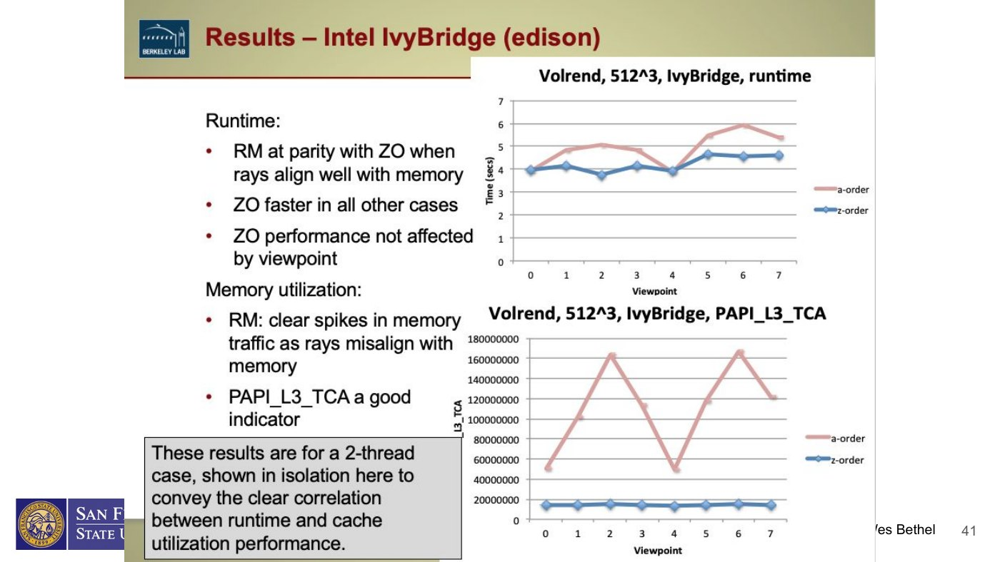

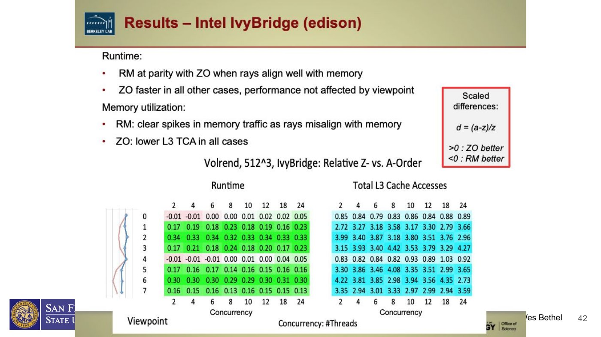

### Hardware prefetching explains directional effects

Hardware prefetchers exist at L1, L2, and LLC levels. Common heuristics include:

- next-line or adjacent-line prefetch;
- detection of forward/backward streams;
- per-instruction constant-stride detection;
- fetching paired cache lines within a larger spatial region.

On contemporary x86 systems, a cache line is commonly 64 bytes. Regular unit-stride access is easy to prefetch. Data-dependent, irregular, or rapidly changing directions are harder. A layout can therefore alter performance even when the nominal number of application-level loads is unchanged.

### Bilateral filtering case study

Bilateral filtering is an edge-preserving smoothing operation. It combines a spatial Gaussian weight with a value/range Gaussian weight, so the output at a point is a normalized weighted sum of neighbors. The neighborhood can be traversed in several orders; the memory order and parallel decomposition interact with the data layout.

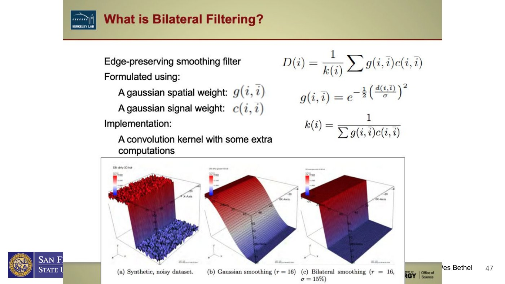

In the shown Ivy Bridge experiments:

- the best row-major processing order depends on stencil size;
- Z-order is faster in most shown configurations, with the slide reporting improvements ranging from about 7% to 231% outside the smallest-stencil exception;
- Z-order produces substantially fewer last-level-cache transactions in many cases.

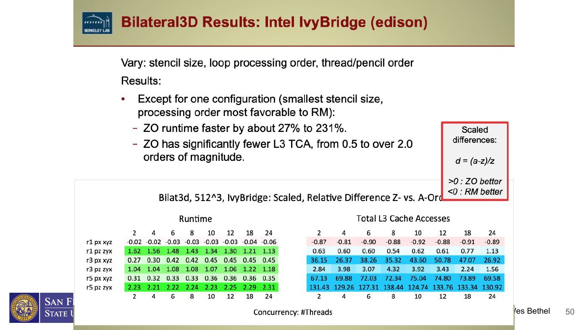

### Matrix multiplication experiments with Z-order

Student experiments compared column-major and Z-order matrix multiplication with blocking/copy and OpenMP on Intel Knights Landing and NVIDIA V100.

- On KNL, Z-order was faster for most displayed sizes, except a small case that fit in cache; the gap narrowed as concurrency increased in some configurations.
- On the V100 GPU, column-major and Z-order results were more similar, showing that a layout advantage on one architecture does not automatically transfer to another.

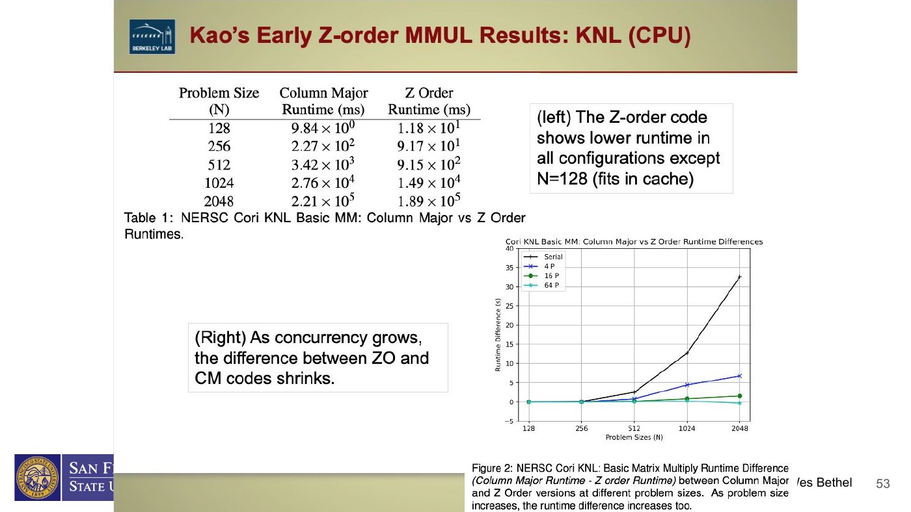

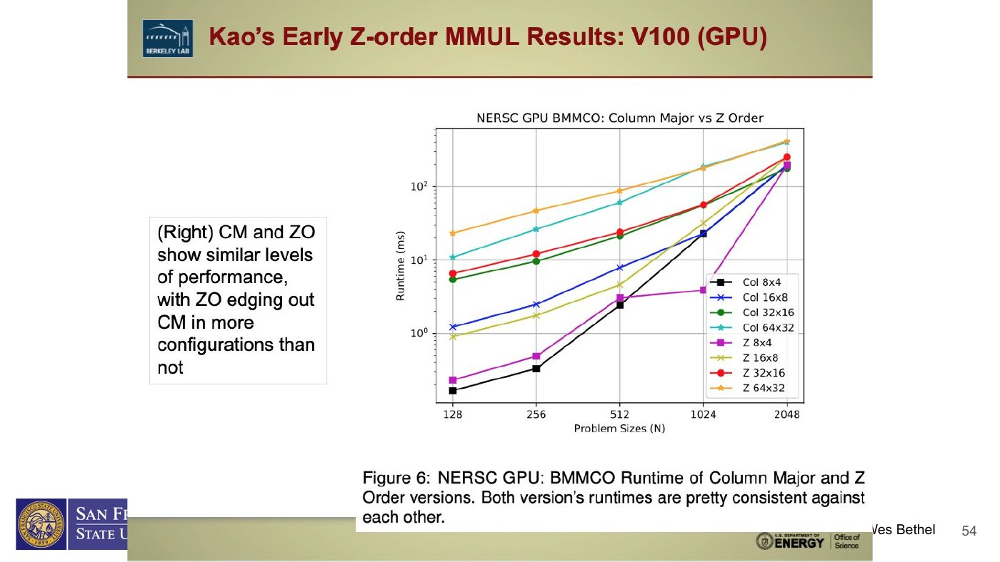

The general lesson is that Z-order remains useful on modern systems, but its value depends on application access patterns, conversion costs, cache size, concurrency, and architecture. It is not a universally superior layout.

## 5. Practical hardware guidance from Drepper

The lecture highlights these conclusions:

- Unit-stride streams cooperate with cache lines and prefetchers; large strides, pointer chasing, and set conflicts do not.
- TLB behavior matters. Page-sized strides can create heavy TLB miss pressure; contiguous layouts and huge pages can help suitable streaming workloads.
- Writes can trigger write allocation and unnecessary reads. Non-temporal stores may help write-only streams when reuse is unlikely.
- Structure-of-arrays (SoA), alignment, and padding can improve vectorization and cache-set use compared with array-of-structures (AoS), depending on the computation.
- NUMA first-touch placement and CPU affinity can dominate performance at scale.

## Agent checklist for cache-optimization analysis

1. Identify the target memory level and estimate the active working-set size.
2. State the cache assumptions: capacity, line size, associativity, and whether prefetching is relevant.
3. Make the inner loop unit-stride where legal.
4. Compare blocking alone with block-and-copy; include packing overhead.
5. Sweep block sizes and matrix sizes. Nearby sizes can expose conflict effects.
6. Consider padding/alignment when simultaneous arrays map to the same sets.
7. Inspect multi-level effects; an L1 improvement can harm another cache level.
8. For recursive/cache-oblivious code, tune and report the practical base case.
9. Measure runtime plus explanatory counters (cache misses, memory traffic, TLB events) when available.
10. Distinguish observed evidence from a plausible mechanism. Never manufacture missing measurements.
