# CSC 746 Lecture 08: Vectorization and Instruction-Level Parallelism

Date: 2026-09-17

Instructor: E. Wes Bethel

Source: `CSC 746 F26 Lecture 08 -- Vectorization and ILP.pdf` (66 slides)

## Purpose of these notes

This is an agent-oriented reference rather than a literal transcription. It preserves the lecture's pipeline and SIMD models, loop transformations, dependency rules, compiler commands, verification workflow, and course-project context. Source page numbers are represented by the linked figures where visual evidence is important.

## Key takeaways

- Pipelining improves sustained completion rate by overlapping stages; it does not necessarily reduce the latency of one instruction.
- Instruction-level parallelism (ILP) comes from overlapping independent instructions and, in multiple-issue processors, starting more than one instruction per clock.
- Loop unrolling exposes independent operations and reduces loop overhead, but it is not the same as SIMD vectorization.
- SIMD applies one instruction to several data elements. Compilers need countable loops, predictable control flow, safe dependencies, and clear aliasing information.
- Optimization is incomplete until compiler reports or generated assembly confirm that vector instructions were emitted.

## Course and semester-project context

The lecture places this material at the transition from serial performance optimization to shared-memory CPU programming.

| Date (2026) | Milestone | Grade weight |
|---|---|---:|
| Sep 29 | In-class pre-pre-proposal idea pitch | 1.0% |
| Oct 2 | Project preproposal | 1.5% |
| Oct 12 | Project proposal | 2.5% |
| Dec 1-10 | Project presentations | 5% |
| Dec 11 | Final code and report | 25% |

A one-page preproposal should state:

- the problem or question;
- the implementation/experimental approach;
- how the work will be evaluated;
- anticipated outcomes.

Suggested project directions include serial optimization (blocking, tiling, loop order, vectorization, counters) and parallelization for either speed or problems too large for one node.

## 1. Pipelining

### Latency versus sustained rate

- **Latency** is the elapsed time for one operation to travel from start to finish.
- **Throughput/sustained rate** is the number of completed operations per unit time after the pipeline fills.

A pipeline overlaps distinct stages that use different resources. The lecture uses a four-stage laundry analogy (wash, dry, fold, store), with each stage taking time `t`.

For `N` independent jobs and `p` stages:

- sequential time: `T_seq = N * t * p`
- ideal pipelined time: `T_pipe = t*p + (N-1)*t`
- ideal speedup: `N*p / (p + N - 1)`, approaching `p` as `N` becomes large

The first result still takes `p*t`; the benefit is that a later result can complete every `t` once the pipeline is full.

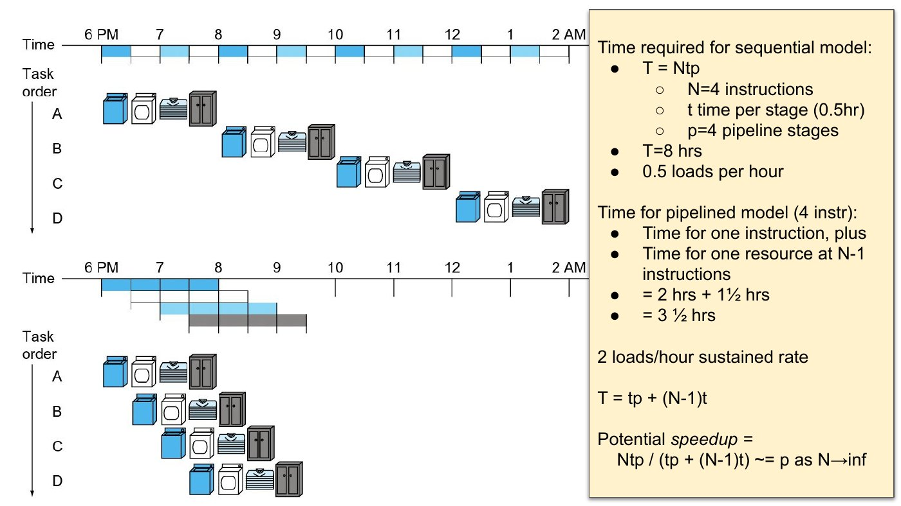

### Simple MIPS pipeline

The five conceptual stages are:

1. **IF** - fetch the instruction from instruction memory.
2. **ID** - decode, read registers, and generate control signals.
3. **EX** - perform an ALU operation or calculate an address.
4. **MEM** - read or write data memory.
5. **WB** - write the result to a register.

Each stage uses a different part of the datapath, allowing instructions in separate stages to overlap.

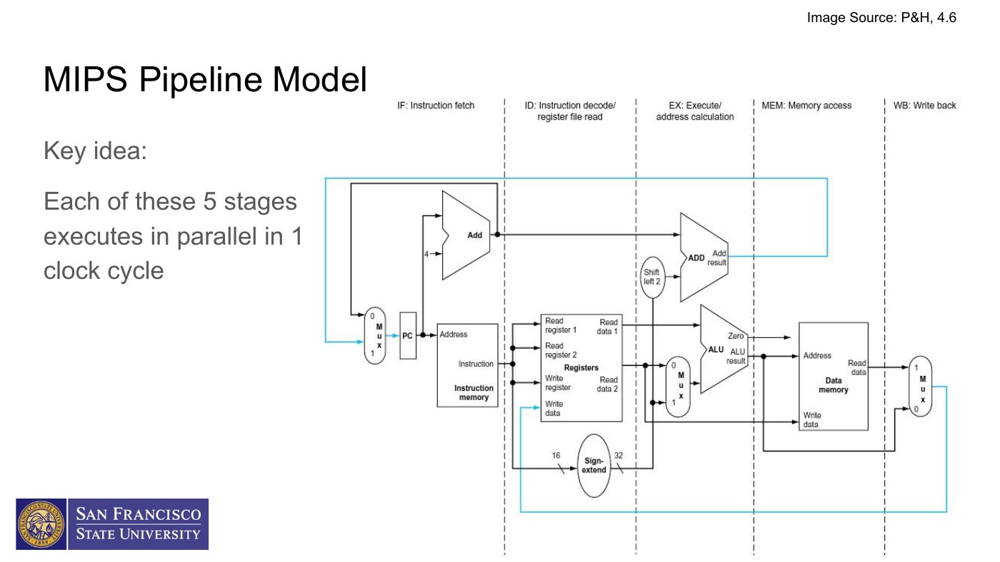

### Stage imbalance and clock period

Instructions use different subsets of resources. In the lecture's timing table:

- instruction fetch: 200 ps;
- register read: 100 ps;
- ALU operation: 200 ps;
- data access: 200 ps;
- register write: 100 ps.

A single-cycle implementation must choose a clock long enough for the slowest complete instruction (800 ps for the shown load). A balanced pipeline can use a period based on its slowest stage (200 ps in the simplified model), plus real pipeline-register overhead. Pipeline hazards and stalls reduce the ideal speedup.

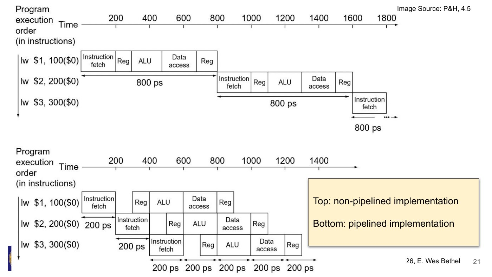

## 2. Instruction-level parallelism (ILP)

Pipelining exploits parallelism among instructions. Two broad ways to increase ILP are:

- deepen the pipeline so more instructions overlap;
- replicate execution resources so multiple instructions can be issued in one clock.

### Multiple issue

- **Static multiple issue**: the compiler chooses compatible instruction groups before execution.
- **Dynamic multiple issue**: the processor chooses and schedules instructions at runtime.

The simplified static MIPS example pairs at most:

- one memory load/store; and
- one ALU/branch instruction.

If no compatible partner exists, a no-op occupies the unused issue slot.

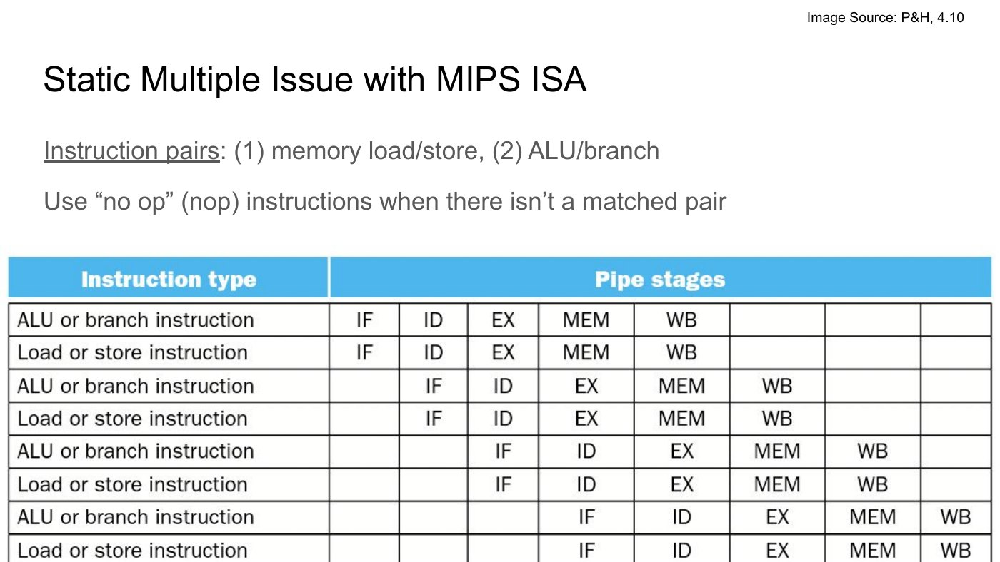

### Speculation

To keep multiple functional units busy, a compiler or processor may predict:

- branch outcomes;
- which loads are safe to start;
- which instructions are independent;
- what resources will be needed.

Speculation permits provisional reordering and resource allocation. Incorrect predictions require recovery and reduce effective throughput.

## 3. Loop unrolling

Loop unrolling duplicates the body, reduces the trip count, and advances the index by the unroll factor.

Original reduction:

```cpp
for (std::size_t i = 0; i < N; ++i) {
    sum += A[i];
}
```

Four-way unrolled form (with four partial accumulators to expose independence):

```cpp
std::size_t i = 0;
double s0 = 0.0, s1 = 0.0, s2 = 0.0, s3 = 0.0;

for (; i + 3 < N; i += 4) {
    s0 += A[i];
    s1 += A[i + 1];
    s2 += A[i + 2];
    s3 += A[i + 3];
}

double sum = s0 + s1 + s2 + s3;
for (; i < N; ++i) {
    sum += A[i];
}
```

Using independent accumulators avoids a single serial dependency chain and is generally more ILP/SIMD-friendly than loading four values and immediately combining them into one accumulator. Always include a remainder loop unless `N` is guaranteed to be divisible by the unroll factor.

### Static scheduling example

The lecture's MIPS example unrolls a loop four times and schedules loads/stores alongside arithmetic. The unrolled body takes 8 clocks for 4 original iterations, compared with 4 clocks per rolled iteration:

- rolled: `4N` clocks;
- unrolled: `8 * (N/4) = 2N` clocks;
- idealized speedup in the example: 2x.

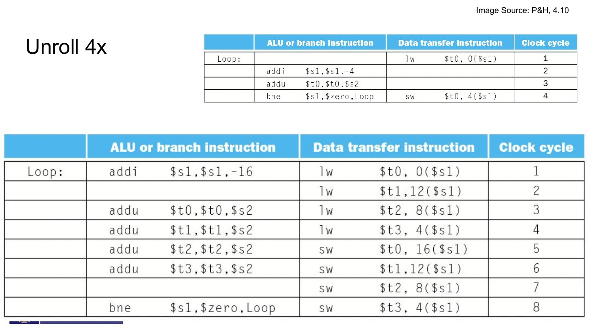

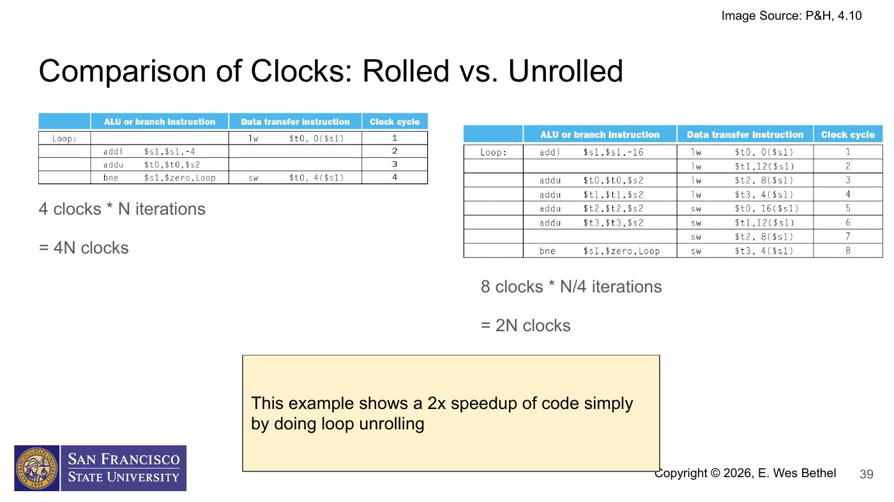

Unrolling can increase code size and register pressure, and excessive unrolling can hurt instruction-cache behavior. Modern compilers often unroll automatically when optimization is enabled.

## 4. Vectorization and SIMD

Scalar instructions operate on one data element at a time. A SIMD instruction applies one operation to several lanes of data. "Vectorization" and "SIMD" are closely related terms, though vector architectures and fixed-width SIMD instruction sets are not identical models.

For elementwise multiply-add:

```cpp
for (std::size_t i = 0; i < N; ++i) {
    c[i] += a[i] * b[i];
}
```

An unrolled scalar loop writes several operations explicitly. A vectorized loop performs the same independent lane operations with vector loads, arithmetic, and stores. For AVX-512 doubles, an FMA instruction operates on 8 doubles and counts as 16 FLOPs (8 multiplies plus 8 adds).

### Ways to vectorize

1. Hand-written assembly: maximum control, highly platform-specific.
2. Compiler intrinsics: integrates with C/C++, still ISA-specific.
3. Automatic compiler vectorization: portable source, but code and flags must permit it.
4. A vectorized library: often the best portability/productivity choice for standard kernels.

The lecture focuses on automatic vectorization.

## 5. Requirements for auto-vectorizable loops

Good candidates normally have:

- a trip count known before the loop begins;
- no data-dependent `break`, `return`, or other early termination;
- straight-line control flow, or conditionals that can become masks;
- no opaque function calls (known vector math or inlined functions can be exceptions);
- independent iterations;
- unit-stride, aligned, contiguous arrays where possible;
- a simple index expression;
- enough work to amortize setup and remainder handling.

## 6. Loop-carried dependencies

The important question is whether iterations can execute as if simultaneous without changing program semantics.

### Read-after-write (RAW): not directly vectorizable

```cpp
for (int i = 1; i < 5; ++i) {
    a[i] = a[i - 1] + b[i];
}
```

Iteration `i` reads the value written by iteration `i-1`. This is a recurrence; naive lane-parallel execution is incorrect.

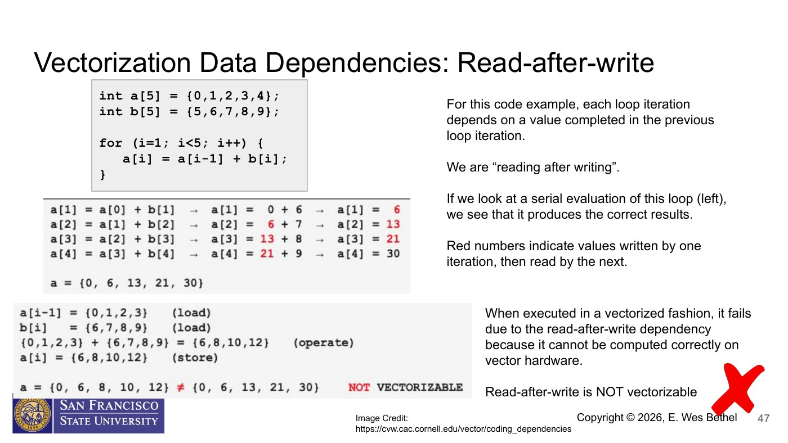

### Write-after-read (WAR): vectorizable in the shown forward loop

```cpp
for (int i = 0; i < 4; ++i) {
    a[i] = a[i + 1] + b[i];
}
```

Each iteration reads a future element before that future iteration overwrites it. A compiler may vectorize this when it can preserve the required load-before-store semantics.

### Write-after-write (WAW): unsafe without restructuring

```cpp
for (int i = 0; i < 4; ++i) {
    c[i % 2] = a[i] + b[i];
}
```

Multiple iterations write the same address, so simultaneous stores have no well-defined serial order. Transform the algorithm or use an explicit supported reduction/combination rule.

### Read-after-read (RAR): safe

```cpp
for (int i = 0; i < 4; ++i) {
    c[i] = a[i] + b[i % 2];
}
```

Repeated reads are safe because no iteration changes the shared source. The irregular subscript may still make the generated SIMD code inefficient.

## 7. Pointer aliasing

Even an apparently independent loop may be unsafe if pointer arguments overlap:

```cpp
void compute(double* a, const double* b, const double* c, int n) {
    for (int i = 1; i < n; ++i) {
        a[i] = b[i] + c[i];
    }
}
```

Calling `compute(s, s - 1, t, n)` makes the loop equivalent to `s[i] = s[i-1] + t[i]`, which has a RAW recurrence.

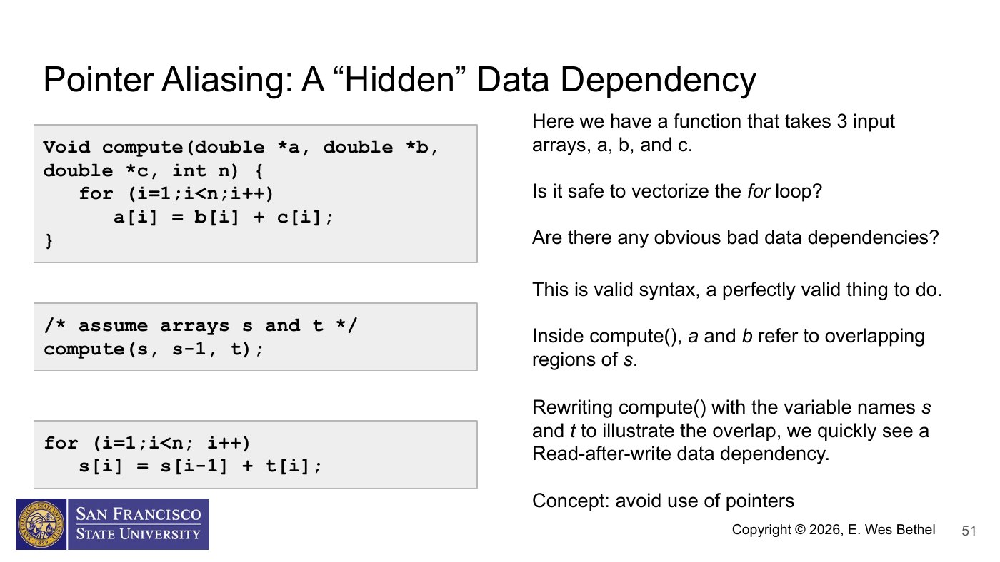

Ways to give the compiler useful safety information include:

- non-overlapping containers/spans enforced by program design;
- `restrict` in C or compiler-supported `__restrict__` in C++ when the promise is true;
- alignment assumptions or pragmas where valid;
- separating potentially overlapping cases from a fast non-aliasing path.

Never add `restrict` merely to silence the compiler; violating the promise creates undefined behavior.

## 8. Compiler flags used in the course environment

The lecture targets GCC/g++ 11.2.0 or the Cray `CC` wrapper on Perlmutter.

Enable optimization/vectorization and emit a report:

```sh
g++ -O2 -ftree-vectorize \
    -fopt-info-vec-all=rpt.txt \
    -c source.cpp
```

For the Perlmutter course environment, the recommended architecture selection is:

```sh
g++ -O3 -march=native \
    -ftree-vectorize \
    -fopt-info-vec-all=rpt.txt \
    -c source.cpp
```

The lecture explicitly cautions against hard-coding `-mavx`, `-mavx2`, or `-mavx512f` on Perlmutter; use `-O3 -march=native` so the compiler selects instructions for the actual node. The course harness's CMake Release build is intended to provide the correct optimized configuration.

For controlled experiments on known x86 targets, ISA flags include:

- `-mavx` - enable AVX (which introduced 256-bit YMM floating-point operations while retaining 128-bit forms);
- `-mavx2` - add broader 256-bit integer/vector capability;
- `-mavx512f` - enable the AVX-512 foundation instruction set.

Do not run a binary on a CPU that lacks the selected ISA.

## 9. Verify what the compiler generated

### Compiler vectorization report

The report should identify which loops were vectorized, the vector width used, and why missed loops were rejected. Read both "optimized" and "missed" entries.

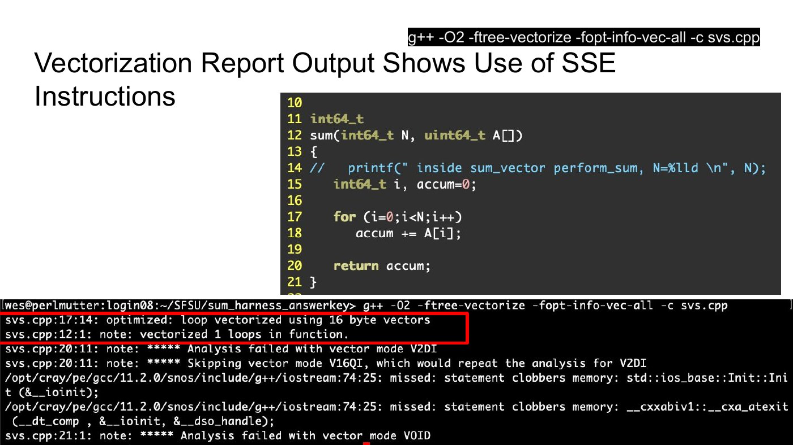

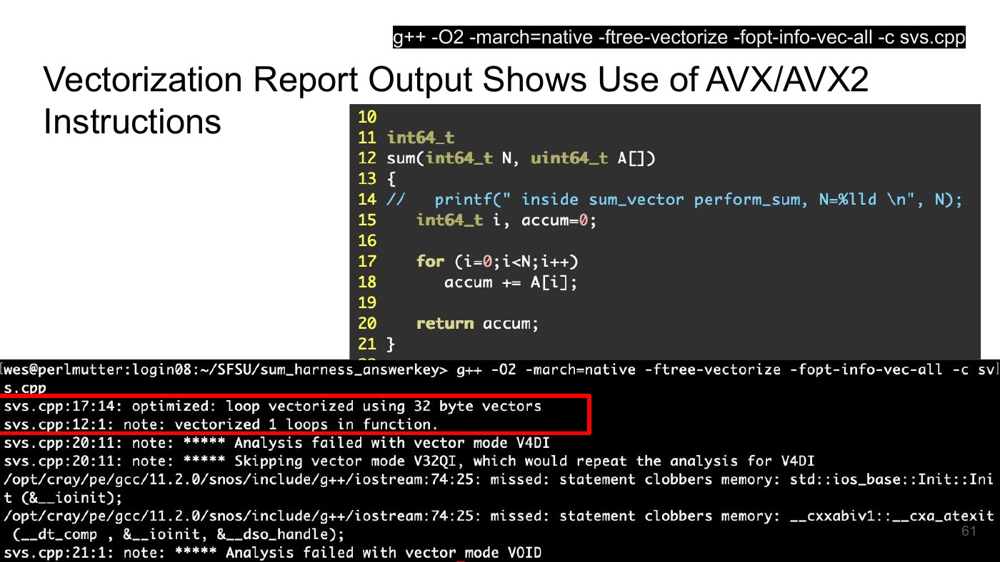

### Generated assembly

Generate assembly with `-S`, or inspect the compiled binary with an appropriate disassembler. Compiler Explorer (godbolt.org) is also useful for small examples.

Register and instruction clues:

| Mode | Typical width | Register names | Example clue |
|---|---:|---|---|
| Scalar integer/FP | one element | general registers / `xmm` scalar forms | scalar `add`, `addsd` |
| SSE | 128 bits | `xmm0`, `xmm1`, ... | packed operations on 16-byte data |
| AVX/AVX2 | 256 bits | `ymm0`, `ymm1`, ... | `vpadd*`, `vmul*`, 32-byte loads |
| AVX-512 | 512 bits | `zmm0`, `zmm1`, ... | 64-byte loads, mask registers, `zmm` ops |

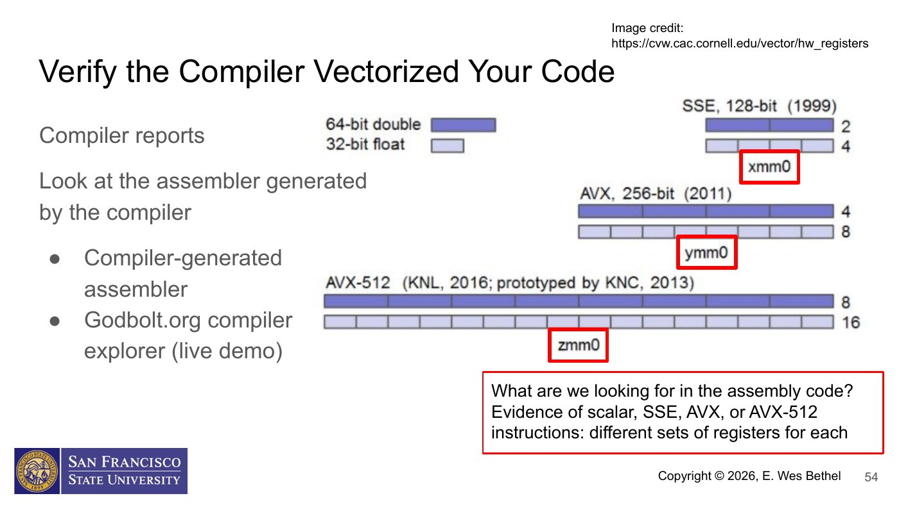

The lecture compares one integer-add loop at several optimization levels:

- `-O0`: many scalar memory operations and substantial loop bookkeeping;
- vectorized SSE: one 16-byte vector access/operation handles two 64-bit elements;
- AVX2: one 32-byte vector access/operation handles four 64-bit elements;
- AVX-512: one 64-byte vector access/operation handles eight 64-bit elements.

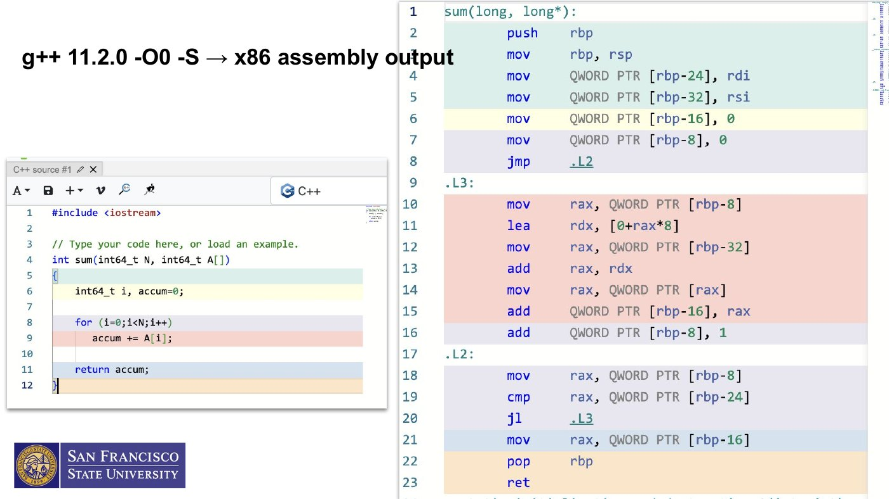

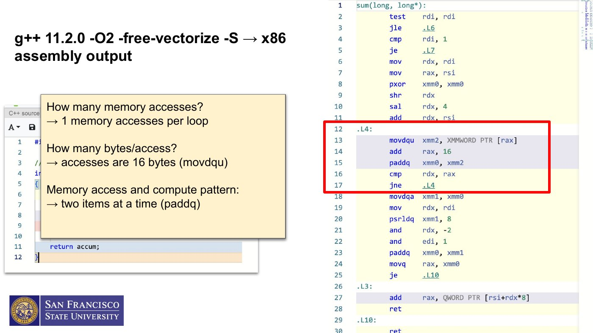

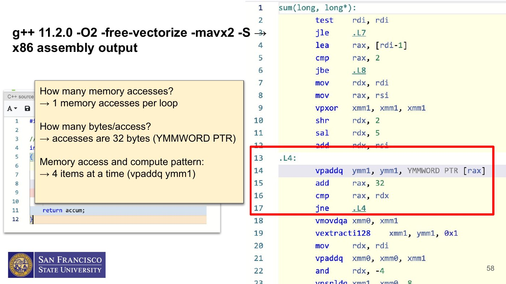

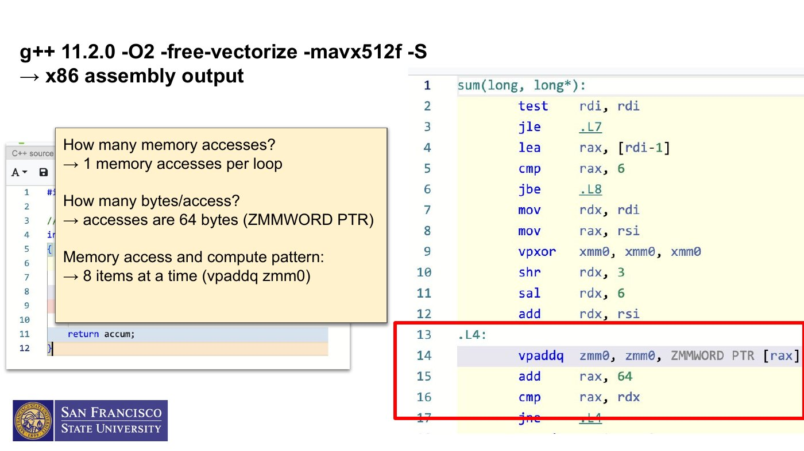

Instruction width alone does not prove a proportional end-to-end speedup. Memory bandwidth, alignment, tails, dependencies, down-clocking, and surrounding serial work all matter.

## 10. Vectorizable-code checklist

Prefer:

- simple counted `for` loops;
- straight-line loop bodies;
- arrays or contiguous vector-like storage;
- direct subscripting by the loop index;
- unit-stride access;
- suitably aligned data;
- one vectorizable data type per hot loop;
- layouts that place concurrently used lane data contiguously.

Avoid or isolate:

- opaque function calls;
- RAW recurrences;
- ambiguous pointer aliasing;
- indirect/gather-heavy addressing unless the ISA and workload justify it;
- data-dependent termination;
- mixed operations that force conversions or block vectorization;
- unverified pragmas that assert false dependency/alignment information.

## 11. Experimental workflow

1. Profile or otherwise identify a loop that contributes meaningful runtime.
2. Preserve a correct scalar baseline and validate optimized output against it.
3. Compile with the course Release configuration.
4. Save the vectorization report.
5. Inspect representative assembly for vector registers/instructions.
6. Measure runtime across problem sizes large enough to amortize startup.
7. Report speedup and an accurately named operation rate where applicable.
8. Explain limits using memory bandwidth, dependency chains, remainder code, cache behavior, or instruction mix.

## Further reference

- Hennessy and Patterson, *Computer Architecture: A Quantitative Approach*, 5th edition, especially vector architecture and pipelining.
- GCC x86 options: <https://gcc.gnu.org/onlinedocs/gcc/x86-Options.html>
- Cornell Virtual Workshop vectorization material: <https://cvw.cac.cornell.edu/vector/>
- AVX-512 family overview:

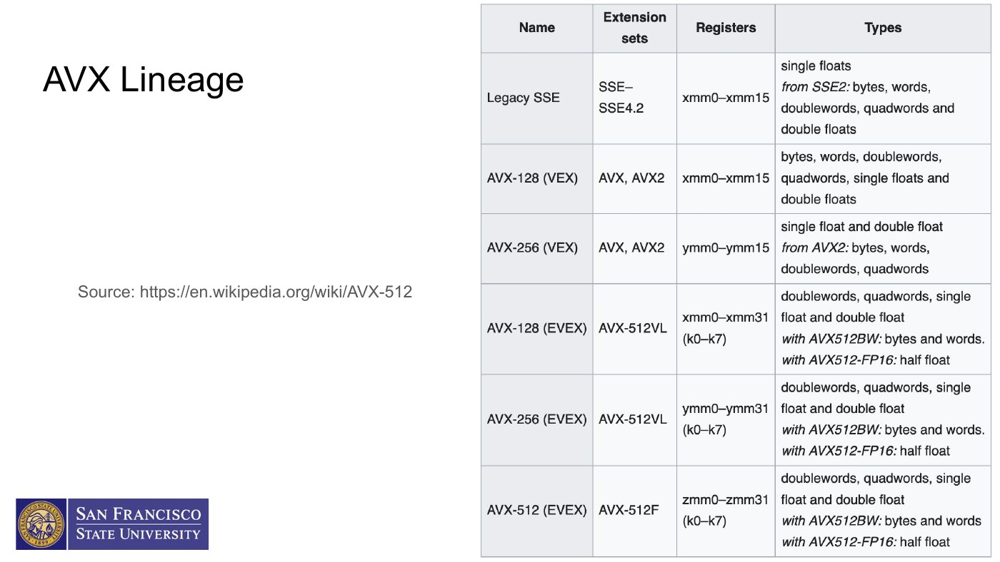
